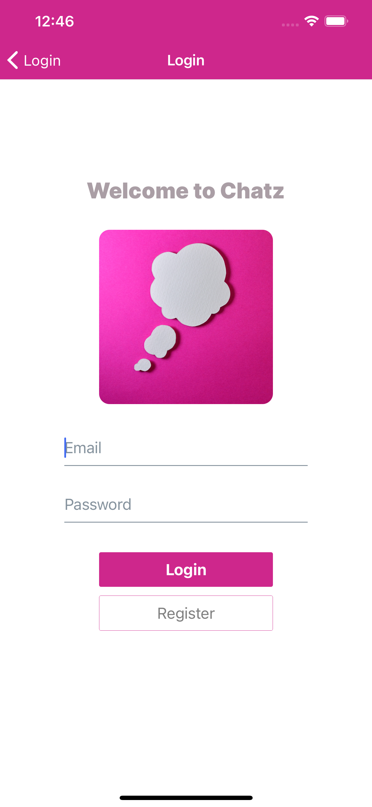
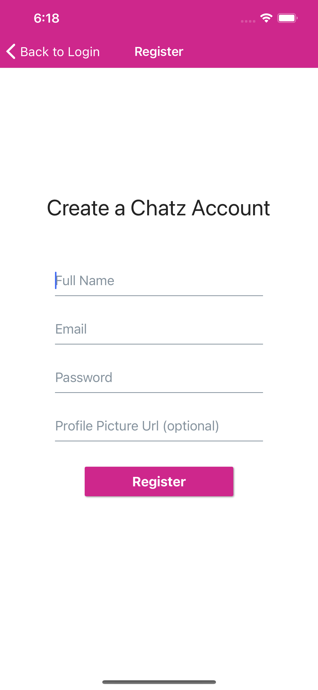
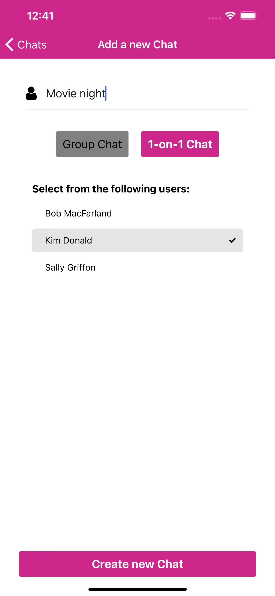
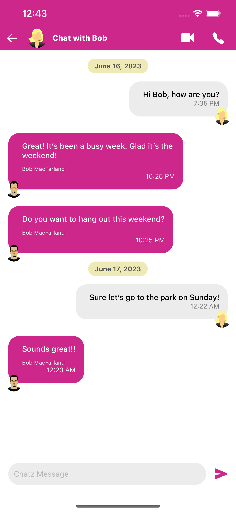
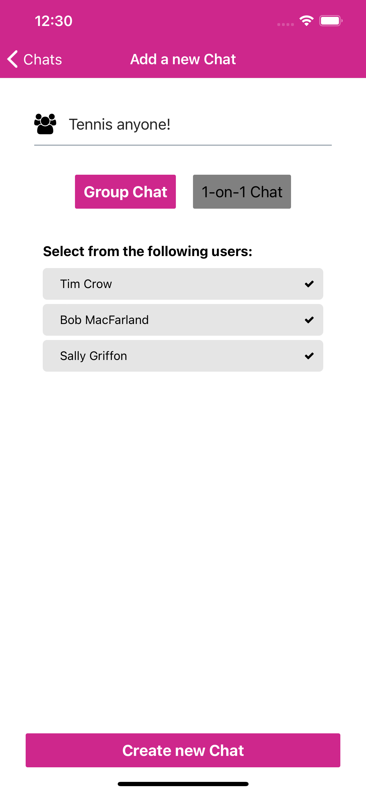
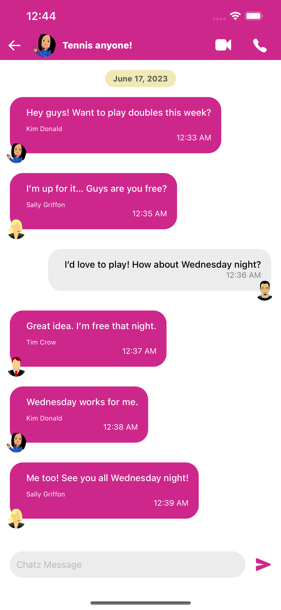

# Chatz
## Chat App built with React-Native and Firebase
> A simple messenger optimized for both iOS and android

### Create an account and start chatting!

- **User Registration/Login**: Users can create an account and login to access the chat app.
- **One-on-One or Group Chats**: Create a chat for you and a friend or create group chats to communicate with multiple people simultaneously.
- **Message Organization**: Messages are organized by the date they were sent, providing a clear timeline of conversations.
- **Timestamps**: Each message includes a timestamp indicating when it was sent by a user.

## Stack / Technologies

- `Expo`
- `React-Native`
- `React-Navigation`
- `Firebase` authentication
- `Firestore` persistence with `async-storage`

## Screenshots

| Screenshot 1 | Screenshot 2 |
|--------------|--------------|
|  |  |

| Screenshot 3 | Screenshot 4 |
|--------------|--------------|
|  |  |

| Screenshot 5 | Screenshot 6 |
|--------------|--------------|
|  |  |

